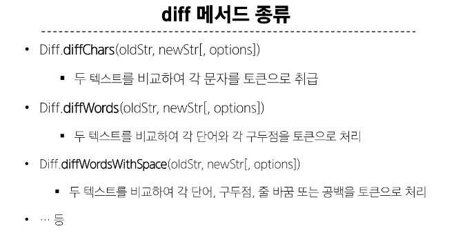
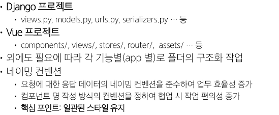

# diff
1. jsdiff : 자바스크립트로 텍스트 구분을 구현한것, 이전과 새 글자를 받아서 두 글자의 차이를 구분
   

# 웹 개발 프로젝트 기획과 설계
## 개요
1. 요구사항 분석
2. 요구사항 분석을 위한것
   1. 핵심 기능 식별
      1. 시스템이 해야할 기능과 추가될수 있는 기능을 구분
         1. 예) 지도기능은 필수기능이고 실시간 위치기능은 추가죌수 있는 기능
      2. 기능 우선순위를 매겨 무엇부터 구현할 지 결정
   2. 사용자 정의
   3. 제약 사항파악
      1. 기술(사용할 스택), 일정(개발 기간), 예산 등등
3. 아키텍쳐와 기술 스택 결정
   1. 아키텍쳐 결정의 의미
      1. 유지보수성과 확장성 확보 : 팀 역할 분담 명확화
      2. 스택 선택 기준
         1. 학습곡선, 커뮤니티 지원, 성능
4. 라이브러리 선정 (뷰 기준 예시)
   1. vue router 도입이 필수적일지
      1. 페이지 전환 빈도, 화면단 이동이나 url 공유기능
      2. 동적 중첩라우팅 기술 필요할지
   2. pinia 도입이 필수 일지
      1. 전역 상태가 많이 복잡해질지
      2. 다수의 컴포넌트간의 데이터 동기화가 필요한지
5. 프로젝트 구조 및 코드 컨벤션
   1. 코드 가독성 유지보수성을 확보
   2. 팀원간 업무 효율
    
   - 네이밍 컨벤션 중요

## 프로젝트 세부 설계
## GIT flow
- 프로젝트 운영하는 브렌치 관리 전략
1. master branch
   1. 실제로 운영중인 서버 코드
   2. 해당 브랜치에서 직접적인 코드 변경은 하지 않는 것을 권장
   3. 다른 브랜치에서 병합과정을 모두 진행한 후 마스터로 병합 후 배포(최고 관리자)
2. hotfix branch
   1. 배로 시기와 상관없이 급하게 처리 해야하는 버그를 수정하는 브랜치

## 문서화