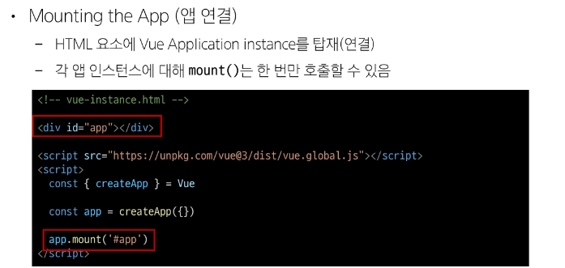
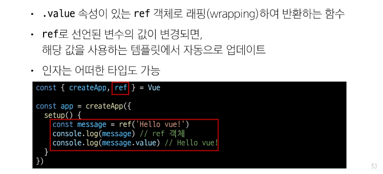

# Frontend Development
- 웹사이트와 웹 애플리케이션의 사용자 인터페이스ui와 사용자 경험 ux를 만들고 디자인하는 것
- html css javascript 등 활용해서 사용자가 직접 상호작용하는 부분을 개발
- 디자인이 단순히 꾸미는게 아닌 사용자가 잘 사용하도록 설계하는 거임 (데이터는 어떻게 다루고 어떻게 접근하게할지 잘 처리되게 할지)


## Client-side frameworks
- 라이브러리와 프레임워크의 차이

  ### ✅ 라이브러리와 프레임워크의 차이

  | 구분        | 라이브러리 (Library)              | 프레임워크 (Framework)                   |
  | --------- | ---------------------------- | ----------------------------------- |
  | **제어 흐름** | 개발자가 호출 (개발자가 주도)            | 프레임워크가 호출 (프레임워크가 주도)               |
  | **유연성**   | 사용자가 원하는 곳에 골라서 사용 가능        | 정해진 구조에 맞춰서 개발해야 함                  |
  | **설계 구조** | 전체 구조를 개발자가 설계               | 프레임워크가 기본 구조 제공                     |
  | **예시**    | jQuery, Lodash, Axios, NumPy | React, Vue, Django, Angular, Spring |

  ---

  ### 📌 비유

  * **라이브러리**는 요리할 때 필요한 *도구들*입니다. 칼, 도마, 후라이팬처럼 내가 필요한 걸 꺼내서 직접 사용하죠.
  * **프레임워크**는 *밀키트*입니다. 요리 순서와 재료가 정해져 있고, 그 순서대로 따라가야 요리가 완성됩니다.

  ---


- 클라이언트 측에서 ui와 상호작용을 개발하기위해 사용되는 자바스크립트 기반 프레임워크
1. Client-side frameworks가 필요한 이유
   1. 동적이고 반응적인 웹애플리케이션 개발
      1. 웹에서 하는 일 많아짐 | 단순히 무언가를 읽는것에서 무언가를 하는 곳으로
      2. 복잡한 대화형 웹사이트를 '웹 애플리케이션'이라 부름 
   2. 코드 재사용성 증가
      1. 컴포넌트 기반 아키텍쳐
      2. 모듈화된 코드 구조
   3. 개발 생산성 향상
      1. 강력한 개발도구 지원

## SAP | single page application
1. 정의 : 단일 페이지에서 동작하는 웹 애플리케이션
2. 작동원리
   

## CSR | client side rendering
1. 정의 : 클라이언트에서 콘텐츠를 렌더링하는 방식
2. 작동원리
3. 
4. 작동예시
5. 

## SAP CSR의 장단점
### 장점
1. 빠른 페이지 전환
   1. 페이지가 처음 로드된후 필요한 데이터만 가져오면되고 자바스크립는 전체 페이지를 새로 고칠 필요 없이 페이지의 일부를 다시 렌더링할수 있기 때문
   2. 다른페이지 갔다가 돌아왔을떄 이미 이전 페이지의 데이터를 가지고 있기에 다시 돌아온 페이지의 데이터를 요청할 필요없음
2. 사용자 경험
   1. 새로고침이 발생하지 않아 네이티브 앱과 유사한 사용자경험 제공
3. frontend & backend 명확한 분리
   1. 프론트엔드(ui렌더링 및 사용자 상호 작용 처리 담당) 백엔드(데이터및 api 제공 담당) : 큰 애플리케이션 더 쉽게 개발하고 유지관리 가능
### 단점
1. 느린 포기 로드 속도
   1. 예) 넷플릭스 '두둥'부분은 데이터 로드하는거임 (로딩중이라고 하는거보다 로고가 나오는게 덜 지루하고 재밌으니까)
2. SEO 검색엔진 최적화 문제
   1. 페이지를 나중에 그려나가서 검색에 잘 노출되지 않을 수 있음
   2. 검색엔진 입장에서는 html를 읽어서 분석해야하는데 아직 콘텐츠가 모두 존재하지 않기 때문
3. 


# VUE
## 뷰란?
1. 사용자 인터페이스를 구축하기위한 자바스크립트 프레임워크
## 뷰의 핵심 기능
1. 선언적 렌더링 declarative rendering
   1. 표준 html을 확장하는 뷰 템플릿 구문을 사용해서 자바스크립 상태 (데이터)를 기반으로 화면에 출력될 html을 선언적으로 작성
2. 반응성 reactivity
   1. 자바스크립트 상태 변경을 추적하고 변경사항이 발생하면 자동으로 DOM 업데이트
## 주요 특징
1. 반응형 데이터 바인딩
2. 컴포넌트 기반 아키텍쳐 : 재사용 가능한 ui 조각
3. 간결한 문법과 직관적인 api
4. 유연한 스케일링 : 작은거부터 큰 애플리케이션까지 적합
## Component
1. 재사용 가능한 코드블록
   1. ui를 독립적이고 재사용 가능한 일부분으로 분할하고 각 부분을 개별적으로 다룰 수 있음

# vue tutorial
## vue application
1.CDN 작성
```js
<script src="https://unpkg.com/vue@3/dist/vue.global.js"></script>
  <script>
```
2.application instance
```js
const {createapp} = Vue
```
- cdn에서 뷰를 사용하는 경우 전역 뷰 객체를 불러오게됨
- 구조분해할당 문법으로 뷰 객체의 createapp함수를 할당
- 전역에 뷰 객체를 불러온다'는게 뭔말???
  -  cdn방식으로 뷰를 사용할때 뷰라는 이름의 전역(global)객체가 브라우저 환경에 자동으로 등록된다는 뜻. 
  -  그래서 위의 1번 코드를 쓰면 해당 스크립트를 로딩하면서 자동으로 vue라는 전역 객체를 만듦. 
  -  즉, window.Vue가 생겨서 아무데서나 Vue.createApp() 같은걸 호출할 수 있게됨
  - 이 뷰 객체안에 있는 기능을 구조분해 할당
    ```js
      const { createApp, ref } = Vue
      //- Vue.createApp() → 이제 createApp만 써도 되게 변수에 빼온 것
      //- Vue.ref() → 반응형 상태를 만드는 것도 미리 변수로 빼옴
      //- 즉, Vue라는 전역 객체 안에 있는 여러 함수를 편하게 꺼내 쓰는
    ```
  - 구조 분해는 안하면???
    ```js
      const app = Vue.createApp({...})
      //항상 Vue.를 붙여야 함.
    ```

3. application instance
```js
const app = createApp({})
```
- 모든 뷰 애플리케이션은 createApp함수로 새 application instance를 생성하는 것으로 시작함 
4. mounting the app 앱연결

5. setup 함수


## 반응형 상태
1. ref()
   1. 반응형 상태(데이터)를 선언하는 함수
   2. ref === reactive refernece 반응형을 가지는 참조 변수를 만드는것
   3. 
   4. 

## vue 기본 구조
1. createApp()에 전달되는 객체는 뷰 컴포넌트
2. 컴포넌트의 상태는 setup()함수 내에서 선언되어야하며 객체를 반환해야함
  ```js
    const app = createapp({
      setup() {
        const message = ref('hihi')
        return {
          message
        }
      }
    })
  ```
### 템플릿 렌더링
  ```js
  // 반환된 객체의 속성은 템플릿에서 사용 가능
  // Mustache syntax를 사용하여 메시지 값을 기반으로 동적 테스트를 렌더링
  <div id='app'>{{message}}</div>

  // 콘텐츠는 식별자나 경로에만 국한되지 않으며 유효한 자바스크립트 표현식을 사용할 수 있음
  <h1>{{message.split('').reverse().join('')}}</h1>

  const app = createapp({
    setup() {
      const message = ref('hihi')
      return {
        message
      }
    }
  })
  ```
### Event Listeners in Vue
- 'v-on' drective 사용해서 DOM 이벤트 수신 가능 
- 함수 내에서 반응형 변수를 변경하여 구성 요소 상태를 업데이트
  ```js
    <div id="app">
    <button v-on:click="increment">button</button>
    <p>{{ number }}</p>
    <p>{{ number }}</p>
    <p>{{ number }}</p>
  </div>

  <script src="https://unpkg.com/vue@3/dist/vue.global.js"></script>
  <script>
    const {createApp, ref} = Vue

    const app = createApp({
      setup(){
        const number = ref(0)
        const increment = function () {
          number.value++
        }
        return {
          number,
          increment
        }
      }
    })
    app.mount('#app')

  </script>
  ```

---
# 참고
## ref 객체


## ref unwrap 주의사항
[추가설명](../../detail-theory/3.%20반응형%20상태%20관리.md)
## SEO


## CSR & SSR

