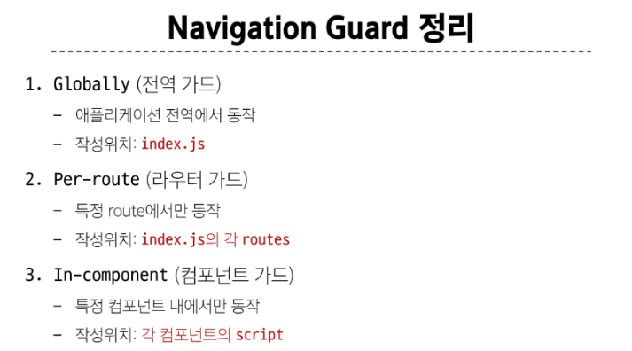

# Named Routes
1. 경로에 이름을 지정하는 라우팅 
   ```js
    <!-- router/index.js  -->
    routes: [
    {
      path: '/',
      name: 'home',
      component: HomeView,
    },


   <!-- app.vue -->
    <nav>
      <!-- ':'바인딩해서 객체를 넘겨준다 -->
      <RouterLink :to="{ name : 'home' }">Home</RouterLink>
      <RouterLink :to="{name : 'about'}">About</RouterLink>
    </nav>
   ```

# Dynamic router matching

# route & router
## router
  - 전체 라우팅 시스템을 관리하는 인스턴스
  - 어떤 url이 어떤 컴포넌트를 보여줄지 설정하고 제어하는 객체
  - 예) routes배열을 담고 있고, push()로 페이지 이동이 가능하게 해줌
  ```js
      // router/index.js
    import { createRouter, createWebHistory } from 'vue-router'
    import Home from '@/views/HomeView.vue'

    const routes = [
      { path: '/', name: 'home', component: Home },
      // ...다른 경로들
    ]

    const router = createRouter({
      history: createWebHistory(),
      routes,
    })

    export default router

  ```
## route
  - 현재 페이지 정보를 담고 있는 객체
  - 예) 현재 경로, 파라미터, 쿼리, 이름
  - useRoute()로 가져올수 있음
  ```js
    import { useRoute } from 'vue-router'

    const route = useRoute()
    console.log(route.path)      // 현재 경로
    console.log(route.params)    // /:id 같은 동적 파라미터
    console.log(route.query)     // ?sort=desc 같은 쿼리

  ```
# Nested Routes
- 중첩된 라우팅
- 중첩된 url구조를 가지는 페이지들을 하나의 부모 컴포넌트 안에서 보여줄 수 있게 하는 기능으로, 장고의 앱네임으로 그룹화를 하는 것과 비슷한 개념

# programmatic navigation
- 사용자가 <router-link>를 클릭하지 않아도 코드로 경로를 이동시키는 방법
- routerLlink대신 자바스크립트를 사용해 페이지를 이동하는 것
## router 메서드
- 다른 위치로 이동
  - router.push()
  - 뒤로가기 가능해짐
- 현재 위치 바꾸기 : router.replace()
  ## router-link & router push
  - router-link
    - 선언적 표현
    - 사용자가 직접 클릭할때 유용, 클릭으로만 이동
  - router.push()
    - 프로그래밍적 표현
    - 조건 이벤트 함수 안에서 이동할떄 유용
    - 클릭말고 조건함수 안에서 이동 가능
    - 예) 로그인후 자동이동, 조건검사 후 이동, 회원가입 후 축하메시지

---
# Navigation Guard
- 뷰 라우터를 통해 특정 url에 접근할때 다른 url로 리다이렉트 하거나 취소하여 네비게이션을 보호
## globally guard
- beforeEach
  - 다른 url로 이동하기 직전에 실행되는 함수
  - 로그인 안함사람 막기, 페이지 이동 로딩, 이전 페이지 기억하기, 관리자 권한 체크
  ```js
      router.beforeEach((to, from, next) => {
      // to: 이동할 대상 라우트 객체
      // from: 현재 위치(출발지)
      // next(): 이동을 계속할지, 막을지, 다른 데로 보낼지를 결정
    })

  ```
## per-route Guard
- 특정 라우터에만 동작하는 가드
- 작성위치 : index.js의 각 rotues
- router.beforeEnter()
  - 특정 라우터에 진입했을때만 실행되는 함수
  - 단순히 url 매개변수나 쿼리값이 변경될때는 실행되지 않고 다른 url에서 탐색해 올 때만 실행됨 
  
# In-component Guard
- 특정 컴포넌트 내에서만 동작하는 가드
- 작성위치 : 각 컴포넌트의 <script> 내부
  - onBeforeRouteLeave()
    - 현재 라우트에서 다른 라우트로 이동하기전에 실행
    - 사용자가 현재 페이지를 떠나는 동작에 대한 로직을 처리
  - onBeforeRouteUpdate()
    - 이미 렌더링된 컴포넌트가 같은 라우트내에서 업데이트 되기전에 실행
    - 라우트 업데잍 시 추가적인 로직을 처리
    - 