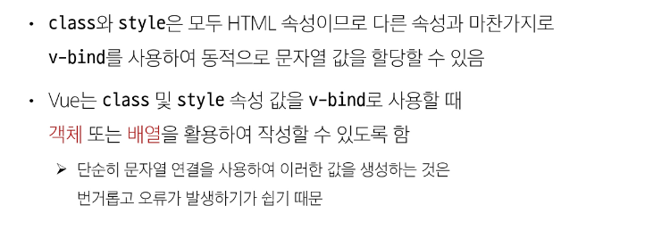
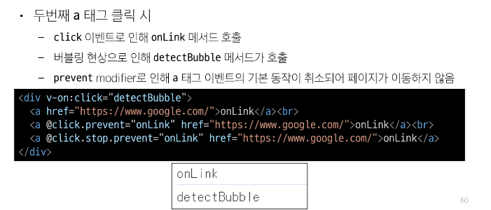

# Template syntax
## 개요
1. 정의 : DOM을 기본구성 요소 인스턴스의 데이터에 선언적으로 바인딩할 수 있는 html기반 템플릿 구문을 사용
2. 종류
   1. text interpolation
   2. raw html
   3. attribute bindings
   4. javascript expressions
### text interpolation

### raw html
```js
<div v-html='rawHtml'></div>
const rawHtml = ref('<span style="color:red">text</span>')
```

### attribute bindings


   #### 바인딩이란 쉽게 설명하면:

   ```html
   <p>{{ message }}</p>
   ```

   이건 **`message`라는 변수의 값이 자동으로 `<p>` 안에 들어가게 바인딩된 것**이야.

   ```js
   const message = '안녕';
   ```

   위처럼 `message`가 `'안녕'`이면, 화면에는 \*\*`<p>안녕</p>`\*\*이 보이게 돼.
   그리고 `message`가 바뀌면, 화면도 자동으로 바뀌는 거야. 이걸 \*\*"양방향 바인딩"\*\*이라고도 해.

   ---

   ### ✅ 속성 바인딩의 예시 (v-bind / `:`)

   ```html
   
   ```

   * `imageUrl` 변수에 `'cat.png'`가 들어있으면 → ``가 돼.
   * 이건 `src` 속성에 `imageUrl` 값을 **바인딩**한 거야.

   ---

   ### ✅ 한 줄 요약

   > **바인딩이란 JavaScript 값(데이터)을 HTML 요소에 연결하는 것.** 값이 바뀌면 화면도 바뀌게 해주는 연결 고리야!

### javascript expressions
- 표현식과 문장, 변수와 값의 차이
- 요약 표

| 구분  | 정의                  | 예시                          |
| --- | ------------------- | --------------------------- |
| 표현식 | 값을 계산해내는 식          | `2 + 3`, `"hi" + name`      |
| 문장  | 동작을 수행하는 코드         | `let x = 5;`, `if (...) {}` |
| 변수  | 값을 저장하기 위한 이름 있는 공간 | `x`, `totalPrice`           |
| 값   | 데이터 자체              | `7`, `'규리'`, `true`         |

---

필요하면 자바스크립트 기준으로 각 예시를 직접 실행할 수 있는 예제도 만들어줄게. 이걸 마크다운으로 정리해줄까?


## Directive
1. 'v-' 접두사가 있는 특수 속성
2. 특징
   1. 속성값은 단일 자바스크립트 표현식이어야함 (v-for,v-on 제외)
   2. 표현식 값이 변경될때 DOM에반응적으로 업데이트를 적용
    ```js
    // 예)
    <p v-if="seen">hihi</p>
    ```
3. 전체 구문
   1. v-on은 이벤트리스너로의 역할
   
   2. arguments
     
   3. modifiers
       
4. built-in directive
   1. v-text, v-show, v-if, v-for ...

# Dynamiccally data binding
## v-bind
- 하나 이상의 속성 또는 컴포넌트 데이터를 표현식에 동적으로 바인딩
- v-bind 사용처
  - attribute bindings
  - class and style bindings
### attribute bindings (속성 바인딩)


---

   ### ✅ 동적 인자 이름 (Dynamic Attribute Name)이란?

   Vue에서는 보통 아래처럼 **정적인 속성명**을 바인딩해:

   ```vue
   <!-- 정적인 인자 (속성 이름이 고정됨) -->
   <button :id="myValue"></button>
   ```

   하지만 경우에 따라 **속성 이름 자체도 동적으로 정해야 할 때**가 있어.
   이럴 때 **대괄호로 감싼 `:[expression]` 형태**를 사용해:

   ```vue
   <!-- 동적 인자 (속성 이름이 변수 key의 값에 따라 바뀜) -->
   <button :[key]="myValue"></button>
   ```

   ---

   ### 🔍 예시

   ```vue
   <script setup>
   import { ref } from 'vue'

   const key = ref('id')
   const myValue = ref('dynamic-id')
   </script>

   <template>
   <!-- 결과적으로 아래는 <button id="dynamic-id"></button>이 됨 -->
   <button :[key]="myValue"></button>
   </template>
   ```

   여기서:

   * `key`가 `'id'`면 → `<button id="dynamic-id">`
   * `key`가 `'class'`면 → `<button class="dynamic-id">`

   즉, `:id`, `:class`, `:name`처럼 **속성 이름 자체를 동적으로 바꾸는 기술**이야.

   ---

   ### ❗주의할 점

   * 대괄호 안 `key`는 **소문자로만** 구성해야 해.
   (브라우저가 속성명을 강제로 소문자로 바꾸기 때문)


### class and style bindings


---
**`:class` 바인딩을 다양한 방법으로 사용하는 예시**들을 보여주고 있어. 핵심은 "HTML 요소의 클래스(class)를 조건이나 상태에 따라 동적으로 바꾸는 방법"을 배우는 거야.

## ✅ 핵심 개념: `:class` 바인딩

Vue에서 `:class`는 HTML의 `class` 속성에 **동적으로 클래스명을 넣는 방법**이야.
이 예제에서는 3가지 방식으로 `:class`를 바인딩해:

---

### ① **객체(Object) 방식**

```html
<div :class="{ active: isActive }">Text</div>
```

* `isActive`가 `true`면 → `class="active"`
* `isActive`가 `false`면 → `class=""` (아무것도 없음)

👉 **키는 클래스 이름, 값은 조건(boolean)**

---

### ② **객체 여러 개 포함하기**

```html
<div :class="{ active: isActive, 'text-primary': hasInfo }">Text</div>
```

* `isActive`가 true → `active` 클래스 추가
* `hasInfo`가 true → `text-primary` 클래스도 추가

✔️ 여러 클래스를 조건별로 제어하고 싶을 때 유용!

---

### ③ **객체 자체를 변수로 분리**

```html
const classObj = ref({
  active: isActive,
  'text-primary': hasInfo
})
```

```html
<div :class="classObj">Text</div>
```

* 아예 객체로 정의해서 넘김
* 위에 작성한 것과 같지만 **코드가 깔끔해짐**

---

### ④ **배열(Array) 방식**

```html
<div :class="[activeClass, infoClass]">Text</div>
```

* `activeClass`가 `'active'`, `infoClass`가 `'text-primary'`면
  → `class="active text-primary"`

✔️ 여러 클래스명을 **고정으로 넣을 때** 유용 (조건 없이 그냥 추가)

---

### ⑤ **배열 + 객체 섞기**

```html
<div :class="[{ active: isActive }, infoClass]">Text</div>
```

* 첫 번째는 조건부 클래스
* 두 번째는 그냥 문자열 클래스

---

## ✅ 정리: 이 예제로 뭘 배우라는 거야?

| 방식                     | 사용 목적         | 예시                                           |
| ---------------------- | ------------- | -------------------------------------------- |
| 객체 `{ className: 조건 }` | 조건에 따라 클래스 추가 | `:class="{ active: isActive }"`              |
| 배열 `[class1, class2]`  | 여러 클래스 고정 추가  | `:class="[activeClass, infoClass]"`          |
| 혼합 `[{}, class]`       | 조건부 + 고정 조합   | `:class="[{ active: isActive }, infoClass]"` |

---

### 🔁 한 줄 요약

> 이 코드는 Vue에서 HTML 클래스 속성을 **조건이나 여러 클래스 이름으로 동적으로 조절하는 법**을 보여주는 실습


---
# Event Handling
## v-on
1. 정의 : dom 요소에 이벤트 리스너를 연결 및 수신

2. v-on 구성
   
### inline handlers
- 주로 간단한 상황에 사용
  ```js
  const count = ref(0)
  <button @click="count++">add 1</button>
  <p>count :{{count}} </p>
  ```
### Method Handlers
- 메서드를 작성해서 호출하는 방식
- inline handlers로 안될때 사용
  ```js
  const increase = function (){
   count.value += 1
  }
  <button @click="increase">hihi</button>
  ```
## modifiers
### event modifiers
1. 이벤트에 대한 처리보다는 데이터에 관한 논리를 작성하는 것에 집중하기기위함 

2. 예시
   
   
   
   
### key modifiers
1. 키보드 이벤트를 수신할 때 특정키에 관한 별도 modifiers를 사용할 수 있음
2. 예
   ```js
   // 엔터 키가 입력되었을때만 onSubmit 이벤트 호출하기
   <input @keyup.enter="onSubmit">
   ``` 

# Form Input Bindings
1. 폼을 처리할때 사용자가 인풋에 입력하는 값을 실시간으로 자바스크립트 상태에 동기화해야하는 경우 (양방향 바인딩)
2. 양방향 바인딩 방법
   1. v-bind & v-on을 함께 사용
   2. v-model 사용 
   
## 단뱡향 양방향 차이
1. 단방향 바인딩 (One-way Binding)

- 정의
  * 데이터가 **Vue → HTML 요소**로만 흐름
  * 사용자 입력이 데이터에 반영되지 않음
  * `:value` 또는 `{{ message }}` 형태로 사용

- 예시

```html
<input :value="username" readonly>
```

* `username` 값을 input에 보여주지만 사용자가 바꿔도 JavaScript 값은 안 바뀜

- 사용 상황

| 상황                  | 설명                |
| ------------------- | ----------------- |
| 데이터를 **출력만** 해야 할 때 | ex) 계산된 총합, 결과 표시 |
| **값을 수정하면 안 되는 필드** | ex) 사용자 ID, 가입일   |
| 복잡한 입력 제어가 필요한 경우   | 이벤트를 수동으로 제어할 때   |
| 성능 최적화가 필요할 때       | 데이터 흐름을 명확히 하기 위해 |

---

2. 양방향 바인딩 (Two-way Binding)

- 정의

* 데이터가 **Vue ↔ HTML 요소**로 양방향 흐름
* 사용자 입력 시 Vue의 변수 값도 자동으로 바뀜
* `v-model` 사용

- 예시

```html
<input v-model="username">
```

* 사용자가 값을 입력하면 `username` 변수도 같이 바뀜

- 사용 상황

| 상황                   | 설명                       |
| -------------------- | ------------------------ |
| 사용자가 값을 입력해야 할 때     | ex) 폼 입력, 검색창            |
| 입력과 동시에 값이 반영되어야 할 때 | 실시간 미리보기 등               |
| 컴포넌트와 값 연동이 필요할 때    | ex) `v-model`을 사용하는 컴포넌트 |

---

- readonly vs disabled

| 속성         | 사용자 입력 | 폼 전송 포함 여부 | 설명          |
| ---------- | ------ | ---------- | ----------- |
| `readonly` | ❌ 불가능  | ✅ 포함됨      | 편집 불가지만 표시됨 |
| `disabled` | ❌ 불가능  | ❌ 포함 안 됨   | 완전히 비활성화됨   |

---

- 요약 정리

   > "출력만 필요하면 단방향, 입력값을 바로 반영해야 하면 양방향으로 선택하자."

   * 단방향: `:value`, `{{ message }}` → 데이터 → 화면 (읽기 전용)
   * 양방향: `v-model` → 데이터 ↔ 화면 (입력값 연동)


## v-model
1. 폼 인풋 요소는 컴포넌트에서 양방향 바인딩을 만듦
2. 사용자 입력 데이터와 반응형 변수를 실시간 동기화
### v-bind with v-on
- 해당 방법은 복잡하기에 v-model 쓸거임 

### v-model 활용
1. 사용자 입력 데이터와 반응형 변수 실시간 동기화
   ```js
    <p>{{ inputText2 }}</p>
    <input v-model="inputText2">

    const inputText2 = ref('')
   ```
   - IME가 필요한 언어(한국어 중국어 일본어 등) 경우 V-MODEL이 제대로 업데이트되지 않음
   - 해당 언어에 대해 올바르게 응답하려면 v-bind&v-on방법을 사용해야함
2. 단순 글자만이 아니라 checkbox, radio,select 등 다양한 타입의 사용자 입력 방식과 함께 사용 가능
3. 체크박스
    
    
    
    - 체크박스는 다중 선택 시 사용하는 것, 하나의 키값에 벨유가 1개 이상,그래서 기본적으로 배열형태로도 관리가능하도록 만들어야함
4. select


# 참고
## $ 접두어가 붙은 변수 
- 뷰 인스턴스 내에서 제공되는 내부변수
- 사용자가 지정한 반응형 변수나 메서드와 구분하기 위함
- 주로 뷰 인스턴스 내부 상태를 다룰때 사용 
# IME

