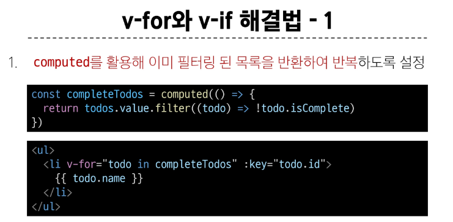
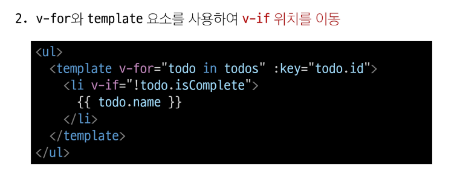
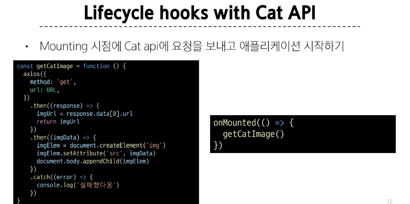

# Computed Property
## computed()
1. 정의
   - 계산된 속성을 정의하는 함수
   - 미리 계산된 속성을 사용하여 템플릿에서 표현식을 단순하게 하고 불필요한 반복 연산을 줄임
2. 필요한 경우
  
  
3. 특징
  
## computed vs Methods

1. 차이
   1. 컴퓨티드는 의존된 반응형 데이터를 기반으로 캐시됨
   2. 의존하는 데이터가 변경된 경우에만 재평가됨
   3. 의존된 반응형 데이터가 변경되지 않는 한 이미 계산된 결과에 대한 여러 참조는 다시 평가할 필요없이 이전에 계산된 결과를 즉시 반환
   4. 메서드 호출은 다시 렌더링이 발생할 때마다 항상 함수를 실행
2. 캐시
   1. 데이터나 결과를 일시적으로 저장해두는 임시 저장소
   2. 이후에 같은 데이터가 결과를 다시 계산하지 않고 빠르게 접근 가능
    
3. computed & method의 적절한 사용처
   
   

# Conditinal Rendering
## v-if
1. 정의 : 표현식 값의 true false를 기반으로 요소를 조건부로 렌더링 


## v-if vs v-show
1. 정의 : 표현식 값의 true false를 기반으로 요소의 가시성을 전환
2. v-show
   1. 이 요소는 항상 DOM에 렌더링 되어있음, css의 display속성만 전환한거라서
    
3. 적절한 사용처
   1. v-if
      1. 초기조건이 false인 경우 아무작업도 수행하지 않음
      2. 토글 비용이 높음
   2. v-show
      1. 초기조건에 관계없이 항상 렌더링
      2. 초기 렌더링 비용이 더 높음
   3. 콘텐츠를 자주 전환해야하는 경우 v-show, 실행중 조건이 변경되지 않는 경우에는 v-if를 권장

# List Rendering
## v-for
1. 정의 : 소스 데이터를 기반으로 요소 또는 쳄플릿 블록을 화면에 반복적으로 렌더링
2. 구조
   1. v-for는 alias in expression형식의 특수구문을 사용
      ```js
        <div v-for="item in items">
          {{item.text}}
        </div>
        // 왜 in으로 순회하냐면, 뷰가 렌더링하는 방식이 그럼
      ``` 
   3. 인텍스(객체에서는 키)에대한 별칭을 지정할 수 있음
      
3. 예시
   1. 배열 반복
   ```js
   
   ``` 
4. 여러 요소에 대한 v-for 적용
5. 중첩된 v-for
## v-for with key
- 반드시 v-for와 key를 함께 사용한다.
- 내부 컴포넌트의 상태를 일관되게하여 데이터의 예측 가능한 행동을 유지하기 위함


## v-for with v-if
- 동일 요소에 v-for와 v-if를 함께 사용하지 않는다.
- 동일한 요소에서 v-if가 v-for보다 우선순위가 더 높기에
- v-if에서의 조건은 v-for 범위의 변수에 접근할 수 없음


- 해결법 : computed활용 & v-for&<tmeplate>요소 활용


# Watchers
1. 정의 : 하나 이상의 반응형 데이터를 감시하고, 감시하는 데이터가 변경되면 콜백함수를 호출
2. 구조
   ```js
   watch(soucrce, (newValue, oldValue) => {
    //do something
   })

   // 첫번째 인자 source
    // watch가 감시하는 대상(반응형변수, 값을 반환하는 함수 등)
   // 두번째 인자 callback function
    // source가 변경될때 호출되는 콜백함수
    // 1. newValue : 감시하는 대상이 변화된 값
    // 2. oldValue(optional) : 감시하는 대상의 기존값
   ``` 
3. 기본 동작
   
4. 예시

5. 여러 socurce를 감시하는 watch
   1. 배열을 활용해 여러 대상을 감시할 수 있음
   ```js
    watch([foo,bar], ([newFoo,newBar], [prevFoo,prevBar]) => {
      // ...
    })
   ``` 
   ```js
      <div id="app">
        <input v-model="foo" placeholder="Foo 입력" />
        <input v-model="bar" placeholder="Bar 입력" />
      </div>

      <script src="https://unpkg.com/vue@3/dist/vue.global.js"></script>
      <script>
        const { createApp, ref, watch } = Vue

        createApp({
          setup() {
            const foo = ref('')
            const bar = ref('')

            // 여러 값을 동시에 감시
            watch([foo, bar], ([newFoo, newBar], [oldFoo, oldBar]) => {
              console.log(`Foo: ${oldFoo} -> ${newFoo}`)
              console.log(`Bar: ${oldBar} -> ${newBar}`)
              console.log('')
            })

            return { foo, bar }
          }
        }).mount('#app')
      </script>


      // watch([foo, bar], callback) 형태로 사용하면 두 변수 중 하나라도 바뀔 때 callback이 호출됨

      // 배열의 첫 번째 인자는 새로운 값들의 배열 [newFoo, newBar]

      // 두 번째 인자는 이전 값들의 배열 [oldFoo, oldBar]

   ```
## computed vs watch


# Lifecycle Hooks
- Vue 컴포넌트의 생성부터 소멸까지 각 단계에서 실행되는 함수


1. 주요 라이프서클 훅 : Mounting
   
2. 주요 라이프서클 훅 : updating


## 활용


# Vue Style Guide


# 참고
## computed 주의사항


## Lifecycle Hooks 주의사항
