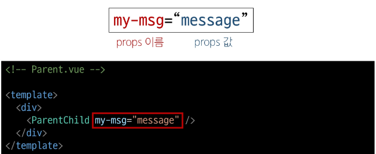
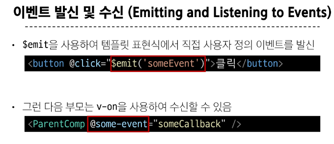
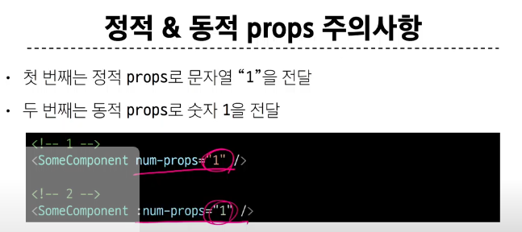

# Passing Props
  부모는 자식에게 데이터를 전달(pass props)하며, 자식은 자신에게 일어난 일을 부모에게 알림(emit event)
## Props
1. 정의 : 부모 컴포넌트로부터 자식 컴포넌트로 데이터를 전달하는데 사용되는 속성
2. 특징
   1. 부모 속성이 업데이트되면 자식으로 전달되지만 그 반대는 안됨
   2. 자식 컴포넌트 내부네서 props를 변경하려고 시도하는거 안됨
   3. 부모 컴포넌트가 업데이트될떄마다 이를 사용하는 자식 컴포넌트의 모든 props가 최신 값으로 업데이트됨
3. one way data flow
   1. 모든 props는 자식속성과 부모속성 사이에 하향식 단방향 바인딩(one way down binding)을 형성
   2. 데이터 흐름의 일관성과 단순화 위해 단방향으로 한거임 
## Props 선언
1. 부모 컴포넌트에서 내려보낸 props를 사용하기 위해서는 자식 컴포넌트에서 명시적인 props선언이 필요
2. props 작성
   1. 부모 컴포넌트 Parent에서 자식 컴포넌트 ParentChild에 보낼 props 작성
    
3. props 선언
   1. defineProps()를 사용하여 props를 선언
   2. defineProps()에 작성하는 인자의 데이터 타입에 따라 선언 방식이 나뉨
4. Props 선언 2가지 방식
   1. 문자열 배열
      1. 배열의 문자열 요소로 props 선언
      2. 문자열 요소의 이름은 전달된 props의 이름
      ```js
        <script setup>
          defineProps(['myMsg'])
        </script>
      ``` 
   2. 객체 사용한 선언
      1. 각 객체 속성의 키가 전달받은 props 이름이 되며 객체 속성의 값은 값이 될 데이터의 타입에 해당하는 생성자 함수(number, string ..)여야함
      ```js
        <script>
          defineProps({
            myMsg : String
          })
        </script>
      ``` 
5. props 데이터 사용
## Props 세부사항
## Props 활용

# Component Events
## Emit
1. 부모가 props 데이터를 변경하도록 소리쳐야함
2. $emit()
   1. 자식 컴포넌트가 이벤트를 발생시켜 부모 컴포넌트로 데이터를 전달하는 역할의 메서드 
   2. $ 표기는 뷰 인스턴스의 내부 변수들을 가리킴, life cycle hooks, 인스턴스 메서드 등 내부 특정 속서에 접근할 때 사용
3. 메서드 구조
   1. $emit(event, .. args)
   2. event 커스텀 이벤트 이름
   3. args 추가인자
4. 
## 이벤트 수신 및 발신
## emit 이벤트 선언

## 이벤트 전달
## 이벤트 세부사항
## emit 이벤트 활용

# 참고
## 정적 동적 props 주의사항

## props & emit 객체 선언 문법