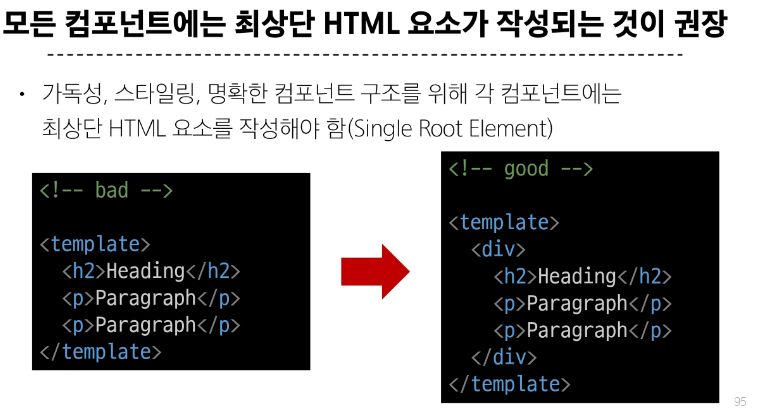

# single file components
## components
1. 재사용 가능한 코드 블록
2. 특징
   1. ui를 독립적이고 재사용 가능한 일부분으로 분할하고 각 부분을 개별적으로 다룰 수 있음
3. single file components : 컴포넌트의 템플릿, 로직 및 스타일을 하나의 파일로 묶어낸 특수한 파일 형식 (뷰파일)
## SFC 구성요소
- 템플릿 스크립 스타일
---

# SFC Build Tool
- vite : 프론트엔드 개발 도구
- build
   
# 뷰 프로젝트
1. 뷰 프로젝트 생성
```js
// 1. 뷰 프로젝트 생성
npm create vue@latest
// 1.1 탭 클릭시 기본값 사용

// 2. 프로젝트 폴더로 이동
cd vue-project
// 3. 패키지 설치
npm install
// 4. 뷰 프로젝트 서버 실행
npm run dev
```
2. npm : node package manager : node.js 기본 패키지 관리자 
# 모듈과 번들러
## 모듈 : 프로그램을 구성하는 독립적인 코드 블록
1. 필요성
   1. 개발하는 애플리케이션의 크기가 커지고 복잡해지면서 하나의 파일에 모든기능을 담기가 어려움
   2. 그래서 파일을 여러개로 분리했고 그 분리된 파일들을 각각 모듈이라함, js파일 하나하나가 모듈
2. 한계
   1. 어플리 커질수록 처리한 모듈 수 증가
   2. 성능 병목현상 발생 -> 모듈가느이 의존성(연결성) 깊어지면서 특정 문제의 원인 발견 어려움
   3. 복잡하고 깊은 모듈간의 의존성 문제 해결위한 도구 필요 : bundler
## bundler
1. 여러 모듈과 파일을 하나의 번들ㄹ로 묶어 최적화하여 애플리케이션에서 사용할 수 있게 만들어주는 도구
2. 역할
   1. 의존성 관리, 코드 최적화,리소스 관리

# Vue Project 구조 | vue component 활용
1. 컴포넌트 사용 2단계
   1. 컴포넌트 파일 생성
   2. 컴포넌트 등록 임포트


# 추가주제
## Vritual DOM
1. 정의
   1. 가상의 돔을 메모리에 저장하고 실제 돔과 동기화하는 프로그래밍 개념
   2. 실제 돔과의 변경사항을 비교를 통해 변경된 부분만 실제 돔에 적용하는 방식
   3. 웹 애플리케이션의 성능을 향상시키기위한 뷰의 내부 렌더링 기술
    


## 뷰를 사용하는 2가지 방법
### Composition API 
- 규모가 있는 앱의 전체를 구축하려는 경우
   

### Option API
- 빌드 도구를 사용하지 않거나 복잡성이 낮은 프로젝트에서 사용하려는 경우


# 참고
- single root element
   
- css scoped
  - 스타일을 입힐 범위를 제한하기위한것
- scaffolding
  - 새로운 프로젝트나 모듈을 시작하기위해 초기구조와 기본코드를 자동으로 생성하는 과정
  - 시간 절약하고 일관된 구조를 유지할수 있도록 도와줌 
- 패키지 관리 주의사항
   